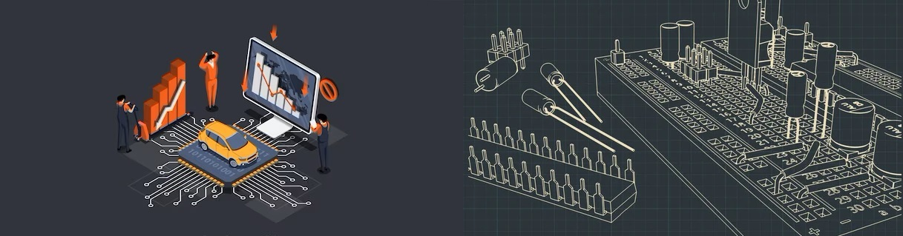

# IoT & Robotics projects with Codes + Circuit Digram



## Microcontroller IOT Boards

- [Arduino boards](https://en.wikipedia.org/wiki/List_of_Arduino_boards_and_compatible_systems) (UNO,MEGA,NANO,LEONARDO etc)
- ESP8266/ESP32/ESP S/C/H DevKit
- Raspberry Pi Pico /W

### Minimal Component Requirements

- One of the above board(Recommended : Arduino UNO)
- _USB type A_ to _USB type B_ Connector Vable
- _USB type A_ to _Micro USB_ Connector Cable
- led(Red,green,blue)
- jumpers(MtoM and MtoF)
- breadboard
- Register(220ohm,1Kohm,10Kohm)
- capacitor(220 microfarad,47 microfarad)
- Buzzer
- 8mm common anode RGB led
- Potentiometer

### Sensors and Modules(Required : based on project)

#### Sensors

- HC-SR04 Ultrasonic distance sensor\*
- DHT11 temparature and humidity sensor\*
- BISS0001 PIR Motion sensor
- MPU-6050 3-Axis Accelerometer and Gyro Sensor
- _TTP223B_ Capacitive Touch Sensor Module
- LM393 Sound Detection Module
- IR receiver + Remote

#### Wireless/Communication Modules

- ESP-01 ESP8266 Serial WIFI Module
- HC-05 Bluetooth Module
- Ublox Neo-6M GPS Receiver Module

#### Displays

- 16x2 LCD
- Single digit _7 segment_ display
- 0.96inch OLED I2C display

#### Motors

- 12V 200 RPM DC Motor
- 28BYJ-48 Unipolar Stepper Motor
- SG90 Servo Motor (180° Rotation)

#### Motor Drivers and Shields

- L293D Motor Driver Shield(Arduino UNO/Mega)
- L293D Motor Driver Board for ESP8266 NodeMcu 12E
- L298N motor driver module
- ULN2003 Stepper Motor Driver
- A4988 driver Stepper Motor Driver

#### Others

- 2N2222 transistor
- 2/4 - channel 5V relay module

## Softwere requirements

- [Arduino IDE(Latest version)](https://www.arduino.cc/en/software)
- [Arduino IDE(v1.8.3 if you have arduino nano)](https://downloads.arduino.cc/arduino-1.8.3-windows.exe)
- [Thonny(If micropython/circuitpython is used)](https://thonny.org/)
- [Platform IO](https://platformio.org/)
- [ESP-IDF](https://docs.espressif.com/projects/esp-idf/en/latest/esp32/)

## How to get started

#### Installation of IDEs and Clone repo.

**_Install the Arduino IDE & Clone this repository_**

```
git clone https://github.com/tirtharajsinha/IOT-and-Robotics.git
```

1. Connect the arduino board via USB.
2. Open the arduino IDE
3. select the board and port number(something like `COM5`)
4. Now open `LED_BLINK/LED_BLINK.ino` in arduino ide.
5. Connect the circuit diagram available the .ino code location.
6. Open the arduino ide and validate and upload the script.
7. If you see led lights up and down periodically then you are good to go. othewise contact a experienced friend. if you friend refuses then your are fucked up, go search on youtube.

#### Upstream the repository

```
git reset --hard origin/main
git remote add upstream https://github.com/tirtharajsinha/IOT-and-Robotics.git
git fetch upstream
git checkout main
git merge upstream/main
```

If anytime you think you messed up with the original repo code then you can consider reset the rerository.

#### Reset repository

```
git reset --hard origin/main
```

## Arduino libraries you need to get started

1. Adafruit Circuit Playground by Adafruit\*
2. Servo by Michael Margolis, Arduino
3. DHT sersor library by Adafruit\*
4. Adafruit Unified sensor by Adafruit\*
5. Firmata by firmata developers
6. WiFi by Arduino
7. LiquidCrystal by Arduino, Adafruit
8. Arduino_JSON by Arduino

## Diffrent type arduino boards

#### Classic family

1. Arduino UNO R3
2. Arduino Mega 2560 Rev3
3. Arduino Leonardo
4. Arduino UNO Mini Limited Edition
5. Arduino Due
6. Arduino Micro
7. Arduino Zero
8. Arduino UNO WiFi Rev2

#### Nano family

1. Arduino Nano 33 IoT
2. Arduino Nano RP2040 Connect
3. Arduino Nano 33 BLE Sense
4. Arduino Nano 33 BLE
5. Arduino Nano Every
6. Arduino Nano

#### MKR family

1. Arduino MKR 1000 WiFi
2. Arduino MKR WiFi 1010
3. Arduino MKR FOX 1200
4. Arduino MKR WAN 1300
5. Arduino MKR WAN 1310
6. Arduino MKR GSM 1400
7. Arduino MKR NB 1500
8. Arduino MKR Vidor 4000
9. Arduino MKR Zero

#### Portena family(Arduino Pro)

1. Portena H7
2. Portena X8
3. Portena Max Carrier(Carrier for portena)

## ESP based boards

As ESP based borads are also available from third-party manufactures like adafruit,unexpectedmaker,wemos etc. so listing all boards impossible. This [Page](https://www.espressif.com/en/products/modules) lists all esp official espressif products.

#### Here we are only listing the popular ESP32 SOC series.

1. ESP8266
2. ESP32
3. ESP32 H2
4. ESP32 C3
5. ESP32 C6
6. ESP32 S2
7. ESP32 S3

### Development Environment and Languages for ESP boards

> ESP32 supports multiple development Environment and Languages

- Arduino IDE (C++)
- ESP-IDF (C and C++)
- PlatformIO (C)
- Thonny (MicroPython,CircuitPython)
- nanoFramework(C#)

### Raspberry Pi 2040 Based Boards

1. Raspberry Pi Pico /W.
2. Adafruit Feather RP2040.
3. Arduino Nano 2040 Connect.
4. Cytron Maker Pi Pico.
5. Adafruit QT Py RP2040.
6. Seeed XIAO RP2040.
7. Pimoroni Tufty 2040.
8. Pimoroni Keybow 2040.
9. Sparkfun Pro Micro.
10. ... etc.

### Development Environment and Languages for RP2040 based bords

> RP2040 based board supports multiple development Environment and Languages

- Arduino IDE (C++)
- PlatformIO (C)
- MicroPython,CircuitPython
- RPi C/C++ SDK

# Setup of Development Environmnts

## Arduino IDE Setup for Boards

### Arduino boards

These board has arduino IDE Support by default.

- Start Arduino IDE
- Plug your board
- Select your board(like: Arduino Uno R3, Arduino Mega, Arduino Nano etc.)
- Select Port (like COM3[for windows], dev/tty0[for linux/OS X] etc.)
- Write Code > Compile code (Tick icon) > Upload Code to board (Upper arrow icon)

### ESP Boards

- Start Arduino and open Preferences window.

- for your specific boards use below url to install boards manager

```
ESP8266
https://arduino.esp8266.com/stable/package_esp8266com_index.json

ESP32/ESP32 H/S/C
https://raw.githubusercontent.com/espressif/arduino-esp32/gh-pages/package_esp32_index.json
```

Put these url into Additional Board Manager URLs field. You can add multiple URLs, separating them with commas.

- Open Boards Manager from Tools > Board menu and find esp8266/esp32 platform.

- Select the version you need from a drop-down box.

- Click install button.

- Don’t forget to select your esp board from Tools > Board menu after installation.

#### Upload program to esp boards

- for **Esp32/esp8266/C3**

  - after initiate upload press and hold the `BOOT` button after upload done unpress boot button

- For **Esp32 S2/S3/C6 <u>[ Boards with 1 usb port on board ]</u>**

  - after initiate upload press and hold the `BOOT` button after upload done unpress boot button

- For **Esp32 S2/S3/C6 <u>[ Boards with 2 usb port on board ]</u>**

  - #### <u>First Way</u> - Connect board to USB to UART bridge (usb port with UART label) [Recommended WAY]

    Before upload Go to `TOOLS` then `USB CDC on BOOT > Disable`, `update the UPLOAD MODE > UART`. Now hit Upload.

  - #### <u>Second Way</u> - Connect board to USB (usb port with USB label)
    Before upload Go to `TOOLS` then `USB CDC on BOOT > Enable`, `update the UPLOAD MODE > Intarnal USB`. Now hit Upload.
    > For First time if it does not get recognised by windows(Which you can check by device manager) press and hold **_BOOT_** button and click **_RESET_** button now unpress the **_BOOT_** button. Now follow the above steps.

#### Additional/Importent Arduino Libraries for esp8266/esp32

1. esp8266 by ESP8266 Community
2. ESP32 by Espressif Systems
3. [ESPAsyncWebServer](https://github.com/me-no-dev/ESPAsyncWebServer)
4. [ESPAsyncTCP for esp8266](https://github.com/me-no-dev/ESPAsyncTCP)
5. [AsyncTCP for esp32](https://github.com/me-no-dev/AsyncTCP)

### Raspberry Pi Pico /W

Follow [this tutorial](https://www.tomshardware.com/how-to/program-raspberry-pi-pico-with-arduino-ide) to set up arduino ide with RPi Pico boards.

[Arduino Core](https://github.com/earlephilhower/arduino-pico) for RP2040 based boards.

## Micropython(Some selected boards are supported) setup

#### Common boards that supported by micropython

1. all esp based boards.
2. Arduino nano RP2040 connect and Arduino Nano 33 BLE Sense
3. Arduino pro portena H7
4. all pyboards
5. Raspberry Pi pico & Pico W
6. BBC micro:bit v1
7. Adafruit Feather series

### Micropython libraries:

Find needed packages from [awesome-micropython.com](https://awesome-micropython.com/)

Follow [This Guide](https://docs.micropython.org/en/latest/reference/packages.html) to install a micropython package.

### IDE Installation

- Now you need a IDE. I prefer **_thonny_** for this as it has REPL terminal For Installation guide follow this [blog form Adafruit](https://learn.adafruit.com/circuitpython-libraries-on-micropython-using-the-raspberry-pi-pico/thonny-setup).

### Firmware Installation to target board

First read micropython [docs](https://micropython.org/download/) to check if your micropython support your board. If your board is supported you can go ahead.

- [Easy method] Connect board to computer via USB > Open thonny > tools > options > interpreter > select Micropython > install or update Micropython.

- [Other Method] Download the micropython firmware file :

  1. [esp32](https://micropython.org/download/esp32/)
  2. [esp8266](https://micropython.org/download/esp8266/)
  3. For others you can find [here](https://micropython.org/download/)

  - Install the flash tool for esp boards :

    ```
    pip install esptool
    ```

    or

    ```
    pip3 install esptool
    ```

    verify installation with `esptool --help` command.

  - Connect the esp board wit your computer and get the port number. It should be like `COM5 or /dev/ttyUSB0`

  - Now open cmd where you downloaded the firmware/bin file.
  - Run the following commands : <br>
    **Notice** : After entering the command before pressing `Enter` press the boot button in your esp board and press enter in your keyboard don't unpress until command executes.<br>
    **Erase previous firmware**
    ```
    esptool --port <PORT_NO> erase_flash
    ```
    **Install micropython firmware**
    ```
    esptool --port <PORT_NO> --baud 460800 write_flash --flash_size=detect 0 <FIRMWARE.bin>
    ```

  #### Clear Flash

  To remove and get back to Arduino IDE, Run the following command :

  ```
  esptool.py --port <PORT_NO> erase_flash
  ```

### Use circuitpython libraries through micropython

First find your device is supported or not [here](https://circuitpython.org/blinka)

Read installation docs [Docs from adafruit](https://cdn-learn.adafruit.com/downloads/pdf/circuitpython-libraries-on-micropython-using-the-raspberry-pi-pico.pdf)

## CircuitPython(Some selected boards are supported)

- Find the [CircuitPython Docs](https://docs.circuitpython.org/en/latest/README.html)

- First search you board [here](https://circuitpython.org/downloads) to check if your CircuitPython support your board.

### Circuitpython libraries and frameworks

CircuitPython libraries are written in Python. They provide additional functionality and support external devices, beyond what is in CircuitPython itself.After connect your board to your computers usb you should see a drive named _CIRCUITPY_. Libraries are stored on your CIRCUITPY drive in a folder called lib.

- You can get the library packages [bundle from here](https://circuitpython.org/libraries) or [Indevidual packages from here](https://learn.adafruit.com/circuitpython-essentials/circuitpython-libraries).
- You can also find the indevidual library from thonny package installer.

### IDE/Text Editor Installation

- Now you need a IDE. I prefer **_thonny_** for this as it has REPL terminal For Installation guide follow this [blog form Adafruit](https://learn.adafruit.com/circuitpython-libraries-on-micropython-using-the-raspberry-pi-pico/thonny-setup).
- For just minor editing you can use **_VS Code_**.

### Firmware Installation

In this case every board have diffrent method to install circuitpython. follow boards specific method in adafruit site.

- Download the circuitpython _BOOTLOADER ZIP_ and .uf2 file [here.](https://circuitpython.org/downloads)

- `[Recommended Method]` follow the Install, Repair, or Update UF2 Bootloader instruction in Adafruit site.

- `[Other Method]` Connect board to computer via USB > Open thonny > tools > options > interpreter > select CircuitPython > install or update CircuitPython.

- ESP32 S/C/H : For reference Follow this [Youtube Video](https://www.youtube.com/watch?v=RYkwgs5rXBM).

- Raspberry Pi Pico with [CircuitPython](https://learn.adafruit.com/getting-started-with-raspberry-pi-pico-circuitpython/circuitpython)

#### Flash Resetting UF2

If your Pico ever gets into a really weird state and doesn't even show up as a disk drive when installing CircuitPython, try installing this [flash_nuke.uf2](https://cdn-learn.adafruit.com/assets/assets/000/099/419/original/flash_nuke.uf2?1613329170) which will do a 'deep clean' on your Flash Memory. You will lose all the files on the board, but at least you'll be able to revive it! After nuking, re-install CircuitPython.

## ESP-IDF

Follow this official instruction for installing [ESP-IDF](https://github.com/espressif/vscode-esp-idf-extension/blob/master/docs/tutorial/install.md) in VS Code.

Follow this [Youtube tutorial](https://www.youtube.com/watch?v=XDDcS7HQNlI) for more precise instruction.

## PlatformIO

[Get started](https://docs.platformio.org/en/latest/tutorials/index.html) with PlatformIO.

Follow This [Youtube Video](https://www.youtube.com/watch?v=JmvMvIphMnY) to learn about installation and Usage.

<hr>

# Board Specific docs

## NodeMCU ESP8266 CH340

- CH340 Driver [Installation Docs](https://learn.sparkfun.com/tutorials/how-to-install-ch340-drivers/all).

## waveshare ESP32-S3-Pico

- Boards specs and pinout - [Here](https://github.com/tirtharajsinha/IOT-and-Robotics/tree/main/boards/ESP/ESP32%20S3/Waveshare%20ESP32-S3-Pico)

- Read full Docs [here](https://www.waveshare.com/wiki/ESP32-S3-Pico).

- This board use a diffrent version of micropython from waveshare, Read [docs how to install](https://www.waveshare.com/wiki/ESP32-S3-Pico#MicroPython)

- Install the [ch343 driver](https://www.waveshare.com/wiki/ESP32-S3-Pico#CH343).

<hr>

<p style="font-size:20px; font-weight:600; text-align:right;"> -- By Tirtharaj Sinha</p>
